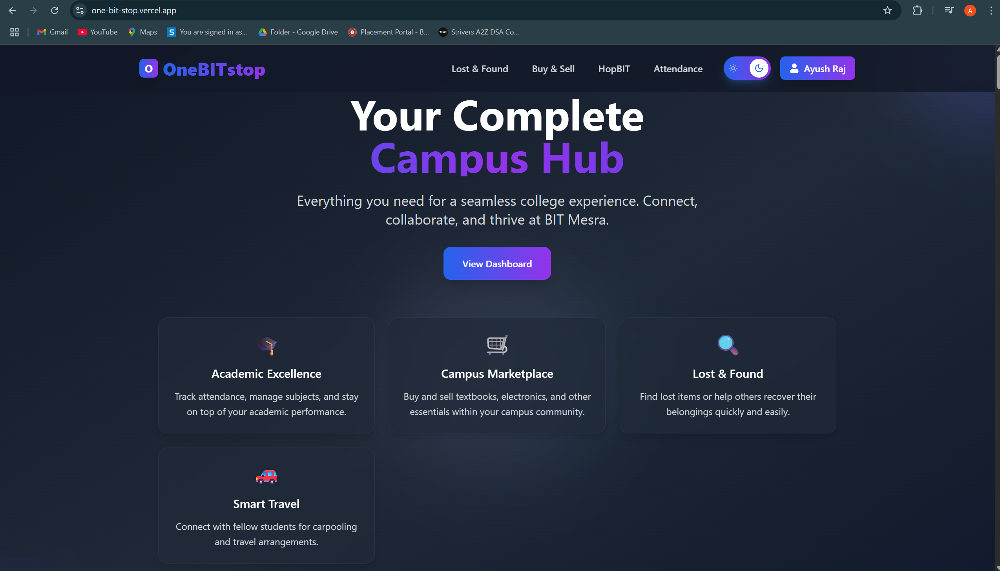
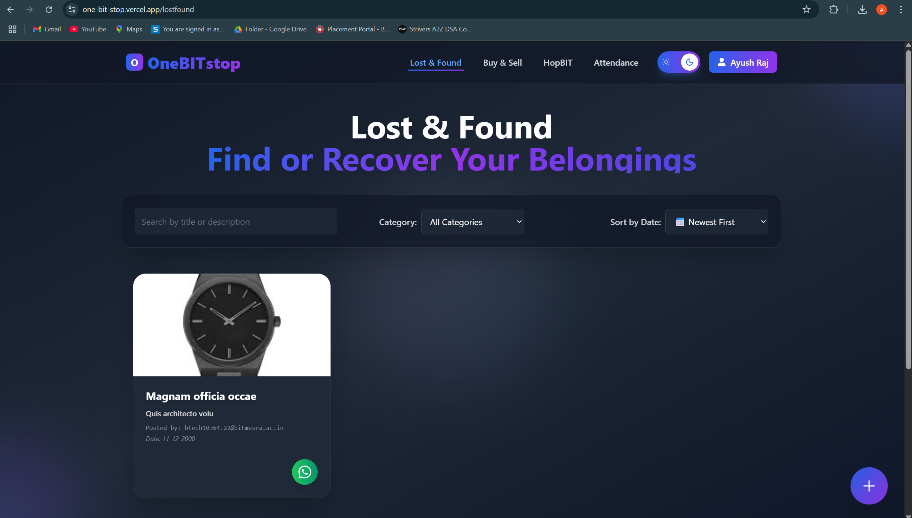
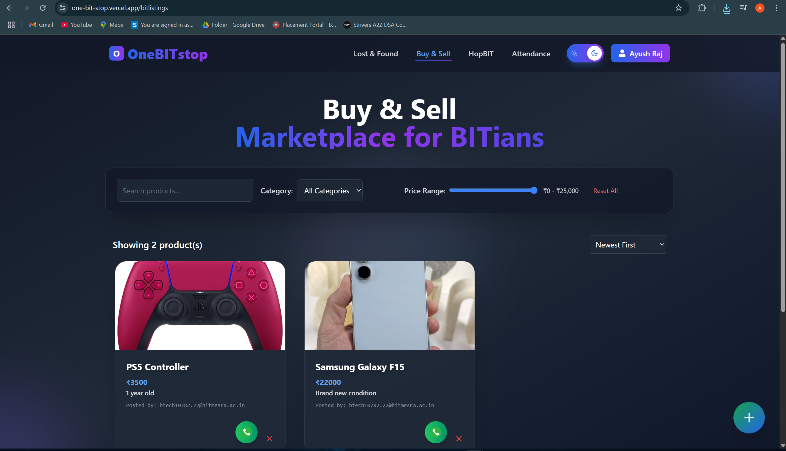
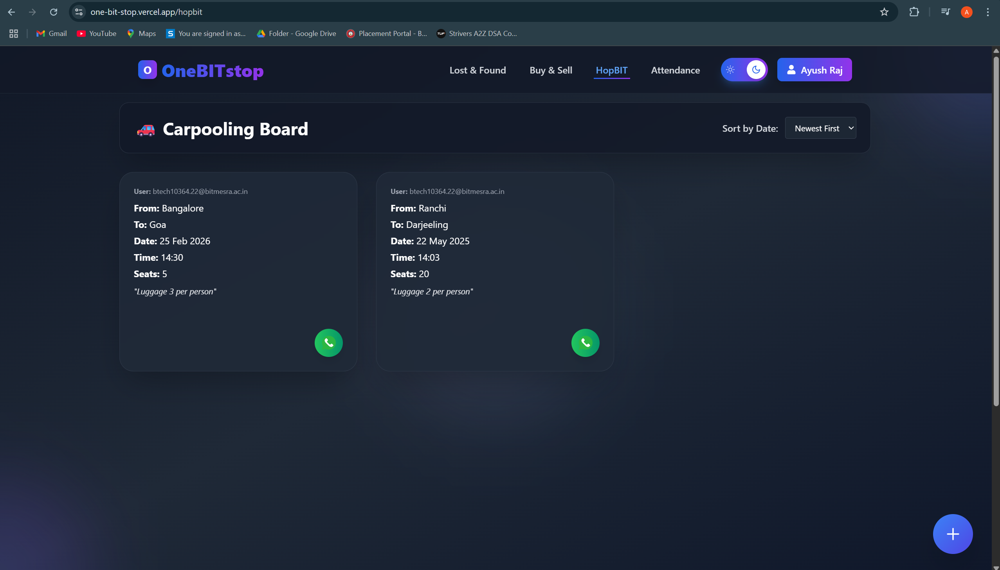
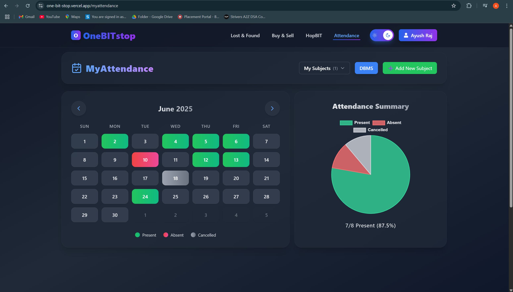
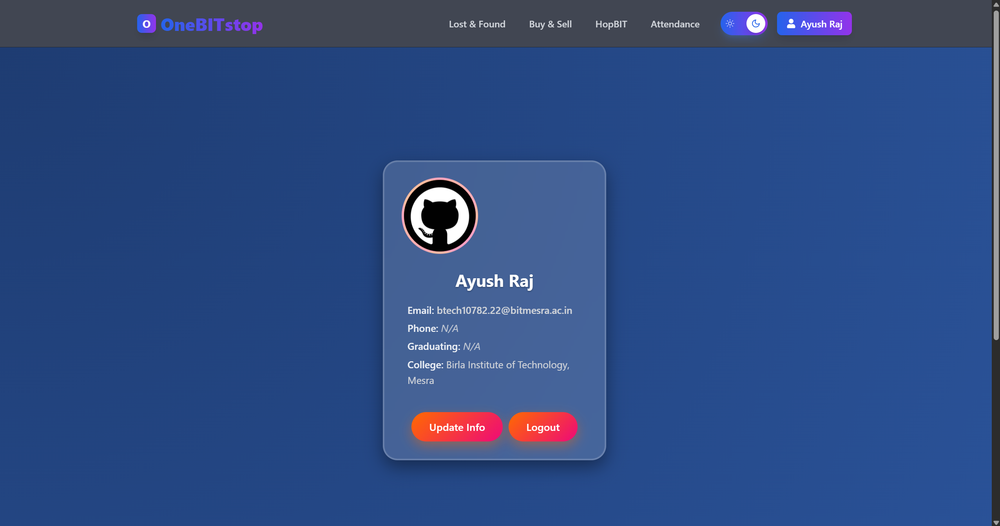

# 🌐 OneBITstop

> **One-stop platform to simplify and supercharge student life on campus.**  
> **Organize. Connect. Elevate. 🎓**

Modern student life is scattered across chats, links, and lost posts — **OneBITstop** unifies everything you need in one sleek dashboard. Built *for students, by a student.*

---

## 🚀 Live Preview

🔗 [**Explore the App Live**](https://one-bit-stop.vercel.app/) — No sign-up required!

---

## ✨ Core Features

A centralized, interactive dashboard for everything that matters on campus:

| 🔹 | Section | Description |
|----|---------|-------------|
| 🧳 | **Lost & Found** | Misplaced something? Report or find lost items easily, all in one place. |
| 🚗 | **Carpooling Hub** | Share rides with fellow students — post your route, comment, and coordinate. |
| 💼 | **Sell & Buy** | A mini OLX for students — trade books, gadgets, or anything useful on campus. |
| 📊 | **My Attendance** | Sleek calendar + subject-wise tracker to stay ahead of attendance shortfalls. |

---

## 🖼️ UI Preview

| Landing Page | Lost & Found | Marketplace |
|----------|----------|-------------|
|  | | 
 |

> 📷 *More screens from the app:*

- 
- 
- 
- 

---

## 🛠️ Tech Stack

This project is crafted using modern tools & best practices:

- ⚛️ **React.js** – Component-based frontend development
- 💨 **Tailwind CSS** – Utility-first modern styling
- 🧠 **Vanilla JavaScript** – Logic, storage, and interactivity
- 💾 **LocalStorage** – Persistence without a backend
- 🚀 **Vercel** – Effortless deployment & CI

---

## 💡 The Idea Behind It

> _“Why should campus essentials be so scattered?”_

From missed events to lost water bottles and uncoordinated carpools — managing college life is overwhelming.  
**OneBITstop** fixes that with a unified digital interface — stylish, intuitive, and made for real student needs.

No more lost info. No more chaos. Just connection.

---

## 🧪 Getting Started

Want to run it locally? Clone the repo and fire it up:

```bash
git clone https://github.com/Aaryan120/OneBITstop.git
npm install
npm run dev
```

> ⚙️ Built using `create-react-app` and optimized for desktop-first usage.

---

## 🌱 What’s Next?

Planned enhancements to take it from helpful to unmissable:

- 🔐 **Authentication** — with college email domain verification
- 🧾 **Admin Dashboard** — moderate posts, spotlight events
- 🔔 **Push Notifications** — never miss an update again
- 📱 **PWA Support** — installable, offline-first experience

---> Make sure Node.js and npm are installed before running the app.

---
## 💡 Future Enhancements

* 🔐 College email login + verification
* 🛠️ Admin panel for moderation
* 🔔 Push notifications for events
* 📱 Mobile-friendly PWA support
* 💬 Reactions & comments on posts

---

## 👨‍💻 Author

Made with ❤️ by [BITians]([https://www.linkedin.com/in/raj-aaryan-38923a25b])
Feel free to connect or drop feedback!

---

## 📬 Feedback & Contributions

Open to suggestions and contributions!
Submit an issue, fork the repo, or reach out via [LinkedIn]([https://www.linkedin.com/in/raj-aaryan-38923a25b]).

---

## 📄 License

MIT License © 2025 [Raj Aryan](https://github.com/Aaryan120)

---

⭐ If you like this project, consider giving it a star!
